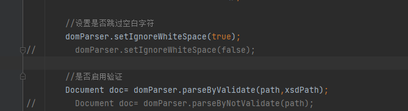

# 第十组 assignment3

在studentlist.xsd中加入了maxOccurs="unbounded"  以支持多个学生

程序中为了展现附加题的应用，采用先解析xml文档1，然后根据需要处理文档结构后，再生成其它同学的信息。

##### 代码见DomParser.java文件，结果见xml文档2,

##### Student.java 为学生信息类

以下为代码中开启空白字符和验证的开关。



分别通过调用下图1，2中的代码实现


然后通过DOM操作文档生成要求的信息，同时包括命名空间的写入通过

```java
 Element root= (Element) doc.createElementNS("http://www.nju.edu.cn/schema","nju:studentList");
        root.setAttribute("xmlns","http://jw.nju.edu.cn/schema");
        root.setAttribute("xmlns:xsi","http://www.w3.org/2001/XMLSchema-instance");
        root.setAttribute("xsi:schemaLocation","http://www.nju.edu.cn/schema StudentList.xsd " +
                        "    http://jw.nju.edu.cn/schema Student.xsd");
```

